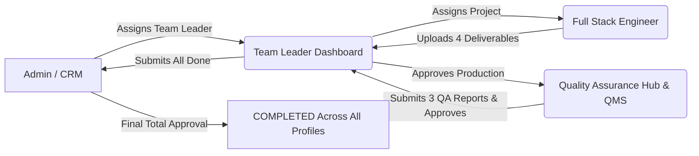

<p align="center">
  
</p>

# 🏢 PJSOFONIC ERP — Enterprise Cloud Platform (Next.js Client)

[](https://erp-pjsofonic.onrender.com/login)
[](https://nextjs.org/)
[](https://tailwindcss.com/)
[](https://supabase.com/)
[](https://www.typescriptlang.org/)

Enterprise Resource Planning (ERP) platform frontend for **PJSOFONIC Enterprise Ecosystem**, featuring multi-department collaboration across Admin, Team Leaders, Full Stack Engineers, and Quality Assurance with automated CRM ingestion, QMS test suite integration, real-time EMS messaging, and Excel/PDF reporting.

---

## 🌐 Live Production Architecture & Links

| Service | Role | Live URL / Endpoint |
|---|---|---|
| **ERP Frontend** | Main Web Application UI | [https://erp-pjsofonic.onrender.com/login](https://erp-pjsofonic.onrender.com/login) |
| **ERP Backend API** | Express REST API & Database Gateway | [https://pjsofonic-erp-backend.onrender.com/api](https://pjsofonic-erp-backend.onrender.com/api) |
| **EMS Directory & Auth** | Real-Time Staff Directory & Login | `https://erp-backend-1-02lc.onrender.com/api` |
| **CRM Backend** | Customer Projects Ingestion | `https://pjsofonic-crm-backend.onrender.com` |
| **QMS Quality Suite** | Live Quality Management & Testing Engine | [https://pjsofonic-qms.onrender.com/](https://pjsofonic-qms.onrender.com/) |
| **Supabase Database** | Cloud PostgreSQL Schema (`project_erp`) | `https://ffauweryjzpnskdaqcyp.supabase.co` |

---

## 🔄 Multi-Department Project Execution Lifecycle



### 1. 👑 Admin Command Hub
- Ingests active customer projects directly from CRM.
- Selects Department Team Leader from registered EMS Team Leaders (`[TL ID] Full Name - Department`).
- Downloads PDF and Excel project dossiers.
- Grants **Final Total Approval**, marking the project as Completed across all profiles.

### 2. 👑 Team Leader Dual Workbench
- **Production Section (`Assigned Projects`)**:
  - Automatically fetches projects assigned by Admin in real-time.
  - Assigns projects to Full Stack Engineers (`[FS ID] Full Name`).
  - Reviews the **4 Full Stack submitted deliverables** (Implementation Plan, Logo Image, Walkthrough, Workflow Chart).
  - Approves and dispatches project directly to the **Quality Profile & QMS**.
- **Quality Section**:
  - Reviews the **3 verified QA reports** (Bug report, Test report, Quality report).
  - Downloads Team Timesheets in Excel and Project Dossiers in PDF/Excel.
  - Submits **"Project All Done"** to Admin for final sign-off.

### 3. 💻 Full Stack Engineer Execution Desk
- Views assigned projects and daily engineering tasks.
- Uploads the **4 required deliverables**:
  1. `Implementation Plan` (Architecture, schemas, endpoints)
  2. `Logo Image` (Asset URL preview)
  3. `Walkthrough` (Test cases, setup guide, demo notes)
  4. `Workflow Chart` (Architecture / process diagram)
- Manages daily interactive **Timesheet TODOs** with one-click Done toggling.

### 4. 🛡️ Quality Assurance Hub & QMS Integration
- Prioritized Quality Auditor workspace.
- Distinct separate actions:
  - **`Submit 3 QA Reports` / `Edit 3 QA Reports`**: Enters Bug Report, Test Report, and Quality Report.
  - **`Approve Report`**: Grants Quality Approval (`QUALITY_APPROVED`) and forwards to Team Leader.
  - **`Test Project`**: Opens the live QMS test platform: [`https://pjsofonic-qms.onrender.com/`](https://pjsofonic-qms.onrender.com/).

---

## 🔔 Real-Time System Notifications & Alerts

Live notification engine synchronized across all profiles with dynamic employee names:
- **Project Assignment**: `"You assigned project <Name> to <Recipient>"` / `"<Sender> assigned project <Name> to you"`
- **Deliverables Uploaded**: `"<Full Stack Name> submitted 4 deliverables for <Project Name>"`
- **Sent to Quality**: `"<TL Name> approved deliverables and sent <Project Name> to Quality testing"`
- **Quality Approved**: `"<QA Auditor Name> approved QA reports for <Project Name>"`
- **Project All Done**: `"<TL Name> marked <Project Name> ALL DONE and submitted for final approval"`
- **Direct & Team Chat**: `"<Sender Name> sent you a message: <text>"`
- **Timesheet Logged / Completed**: `"<Employee Name> created timesheet: <task>"` / `"<Employee Name> marked timesheet task as Done"`

---

## 💬 Two-Way Real-Time EMS Communication Hub (`/communication`)

- **Team Channel Tab**:
  - For **Team Leader Login**: Directory strictly displays **Full Stack Engineers (`💻`)** and **Quality Staff (`🛡️`)**.
  - For **Admin Login**: Directory strictly displays **Team Leaders (`👑`)** and **Quality Staff (`🛡️`)**.
- **Direct DM Chat Tab**:
  - Displays **ALL registered employees** from the live EMS database (`https://erp-backend-1-02lc.onrender.com/api/employees`).
  - Real-time 2-way messaging sync across open tabs and browser windows.

---

## 📊 Automated PDF & Excel Reporting

- **Project Dossiers**: Formatted export with client scope, financial budget, production deliverables, and verified QA reports.
- **Team Timesheets**: Formatted Excel export detailing employee IDs, completed tasks, and total logged hours.

---

## 🛠️ Environment Variables (`.env.local`)

```env
NEXT_PUBLIC_BACKEND_URL="https://pjsofonic-erp-backend.onrender.com/api"
NEXT_PUBLIC_CRM_API_BASE="https://pjsofonic-crm-backend.onrender.com"
NEXT_PUBLIC_SUPABASE_URL="https://ffauweryjzpnskdaqcyp.supabase.co"
NEXT_PUBLIC_SUPABASE_PUBLISHABLE_KEY="sb_publishable_bLkboY3aqcA-LRqg7VROgw_IjxTh84f"
```

---

## 🚀 Local Development Setup

```bash
# 1. Install dependencies
npm install

# 2. Start local dev server
npm run dev

# 3. Build production bundle
npm run build

# 4. Start production server
npm run start
```
