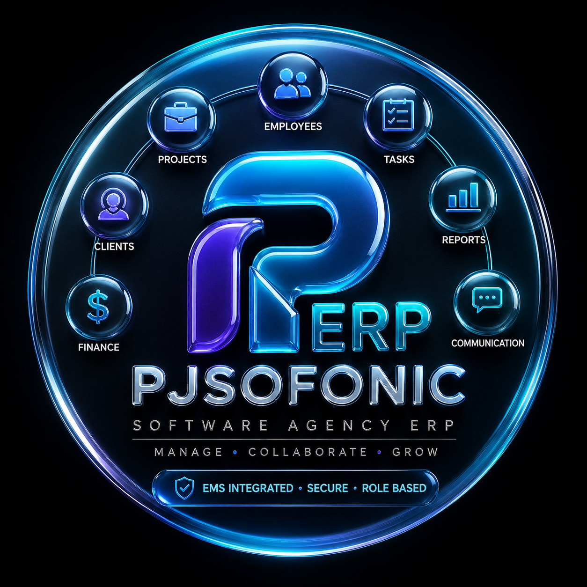

# PJSOFONIC ERP - Enterprise Frontend Client



> Official Repository: [https://github.com/mrCoderPj04/ERP-PJSOFONIC.git](https://github.com/mrCoderPj04/ERP-PJSOFONIC.git)

PJSOFONIC ERP is an Enterprise Software Agency Operating System built with **Next.js (App Router)**, **TypeScript**, **TailwindCSS**, and **Lucide Icons**. It seamlessly integrates real-time authentication and employee management directly with the **PJSOFONIC EMS Backend**, customer project approvals from **PJSOFONIC CRM**, a real-time Quality & AGM Quality Audit testing pipeline, and a live two-way real-time team communication system.

---

## 🚀 Features & Architecture

### 🔒 1. Real-Time EMS Authentication & Route Protection
- **Live Verification**: Direct authentication against PJSOFONIC EMS API (`https://erp-backend-1-02lc.onrender.com/api/auth/login`).
- **Strict Access Control**: Unregistered users are blocked. Authenticated sessions restore profile details (`fullName`, `employeeId`, `email`, `phone`, `department`, `designation`, `role`, `avatarUrl`) directly from the EMS master database.
- **Route Guard**: Client-side layout wrapper protects all protected routes and automatically redirects unauthenticated users to `/login`.

### 👥 2. Role-Based Dynamic Controls & Dashboards
- **Team Leader (TL / Admin) Dashboard**:
  - **Condition 1 Flow**: Ingests approved customer projects from PJSOFONIC CRM (`https://pjsofonic-crm-backend.onrender.com`).
  - Allows Team Leads to break down projects into technical milestones and assign tasks to registered EMS engineers.
- **Quality & AGM Quality Audit Hub**:
  - **Condition 2 Flow**: Live queue of tasks submitted by developers (`WORK_SUBMITTED`).
  - Quality staff inspect implementation notes and verify testing status (`IN PROCESS` ➔ `DONE`).
- **Employee Workbench**:
  - View assigned tasks, track priorities, and submit completed work for quality verification.

### 💬 3. Live Two-Way Communication Center
- **Team Channel (📢)**: Broadcast agency-wide announcements across all registered EMS employees.
- **Direct Messaging (💬)**: Select any employee or admin from the live EMS Directory for instant 1-on-1 private messaging.
- **Real-Time Cross-Tab Synchronization**: Instant state synchronization using `chatStore` pub/sub events.

### 📁 4. Clean & Modern UI/UX
- Custom dark-theme glassmorphism design with responsive TailwindCSS layouts.
- Fallback dynamic initial avatars for employees without custom profile pictures.
- Pure Server Component Root Layout for maximum Next.js App Router performance.

---

## 🛠️ Getting Started

### 1. Prerequisites
- **Node.js**: v18.x or higher
- **npm**: v9.x or higher

### 2. Installation
```bash
git clone https://github.com/mrCoderPj04/ERP-PJSOFONIC.git
cd ERP-PJSOFONIC/frontend
npm install
```

### 3. Running Locally
```bash
npm run dev
```
Open [http://localhost:3000](http://localhost:3000) in your browser. The root page automatically redirects to `/login`.

---

## 📜 Repository Link
- **Frontend Repository**: [https://github.com/mrCoderPj04/ERP-PJSOFONIC.git](https://github.com/mrCoderPj04/ERP-PJSOFONIC.git)
